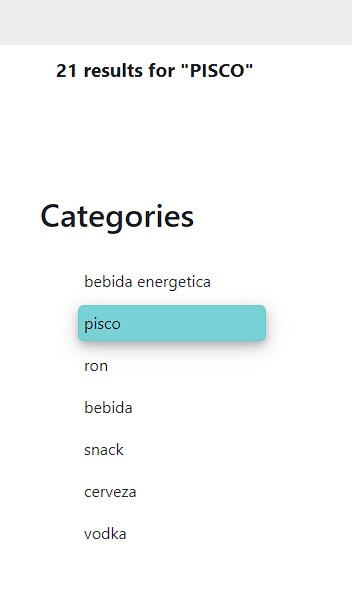
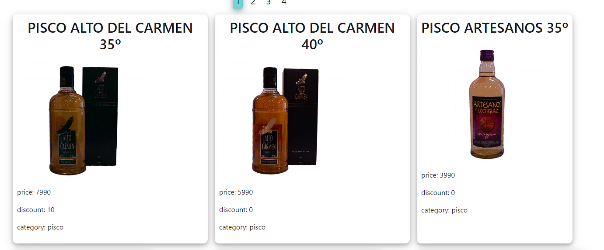

# Bsale-client

## Requisitos generales:
Generar un Frontend que permita lo siguiente:
- Desplegar productos agrupados por la categoría a la que pertenecen.
- Agregar un buscador.
- Desarrollar la aplicación de cliente con vanilla javascript/Vanillajs.
- Disponibilizar la aplicación en un hosting

## Autoria
Este ejercicio, no tiene ningún fin comercial ni estratégico, sólo busca medir habilidades y conocimientos

***

## **Herramientas/Dependencias utilizadas**
 - La aplicación ha sido desarrollada usando unicamente HTML, JavaScript y css.

## **Arquitectura del sistema**
La página interactua con el Backend mediante peticiones a los 2 EndPoints provistos.
En el archivo `index.js` se puede apreciar que se realiza un fetch inicial de los productos y categorias para hacer una muestra inicial.
Mediante la barra de busqueda se puede añadir el filtro por nombre, al hacer la busqueda por nombre se elimina el filtro de categoria y la pagina que se muestra es la default (página 1).
En cambio el filtro por categoria, se acumula al de nombre, pero también muestra la página default.
La paginación está implementada desde el back, por lo cual cada vez que se cambie de página se hace un fetch, el cambio de páginas no borra los filtros de categoria o nombre.

## **Estructura de la página**
En la parte superior se encuentra una barra de busqueda, que nos permite filtrar productos por nombre.
Solo tenemos que escribir parte del nombre del producto y apretar 'enter' o hacer click en el icono a la derecha.

***
A la izquierda y debajo de la barra de busqueda, podemos observar la cantidad de resultados y más abajo los distintos filtros que podemos aplicar.
Como se aprecia en la imagen una vez seleccionado un filtro este queda destacado y podemos quitarlo volviendo a hacer click en él

***
En caso de que la cantidad de resultados exceda el limite de la página podremos observar una paginación justo debajo de la barra de busqueda.
Al igual que los filtros, la página en la que nos encontremos se verá resaltada.
Esta paginación se encuentra implementada desde el back.

***
Al centro de la página se podrán observar los items resultantes de la busqueda

### **Deploy**
La aplicación se encuentra deployada en Vercel: https://bsale-client-eight.vercel.app/